 

This app is a web interface for the Bioconductor package RNAAgeCalc. To use it, follow 
the steps below.

### Step 1
Click on "Browse" to upload gene expression data. 

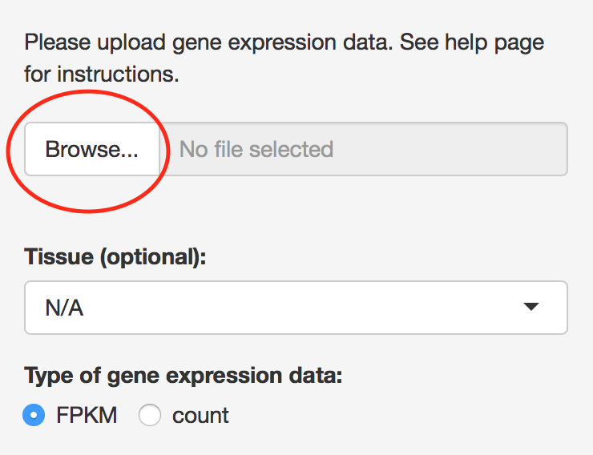{ width=40% }

The gene expression data could be either FPKM or raw count. Here are the requirements of the uploaded file:

* The file should be in **csv** format. 
* Each row represents a gene and each column represents a sample.
* The 1st column should be gene ids.
* The 1st row should be sample ids.

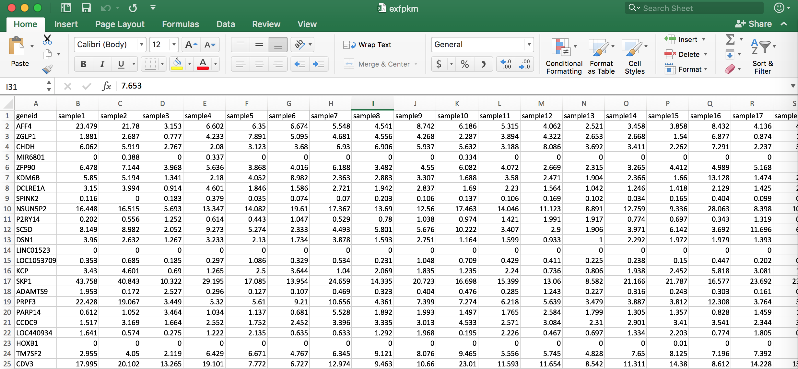{ width=100% }

An example of FPKM data can be found here    
An example of raw count data can be found here 

Users are expected to upload a txt file with 1st column CpG IDs, and 2nd column p-values correspond to the CpGs. For example:

cg13869341 &nbsp;&nbsp; 0.307766  
cg14008030 &nbsp;&nbsp; 0.257672  
cg12045430 &nbsp;&nbsp; 0.552322  
cg20826792 &nbsp;&nbsp; 0.056383  
cg00381604 &nbsp;&nbsp; 0.468549  
cg20253340 &nbsp;&nbsp; 0.483770  
cg21870274 &nbsp;&nbsp; 0.812402  
...  
...  
...  
cg21106100 &nbsp;&nbsp; 0.079276  
cg08265308 &nbsp;&nbsp; 0.748265  
cg14273923 &nbsp;&nbsp; 0.553923  

Files should be no more than 100MB. Please check [**cpg_file_example.txt**](https://github.com/reese3928/methylGO-RShiny-app/raw/master/cpy_file_example.txt) for a toy dataset on Illumina 450 K Beadchip. 

 

\noindent
2. Choose array type and group.

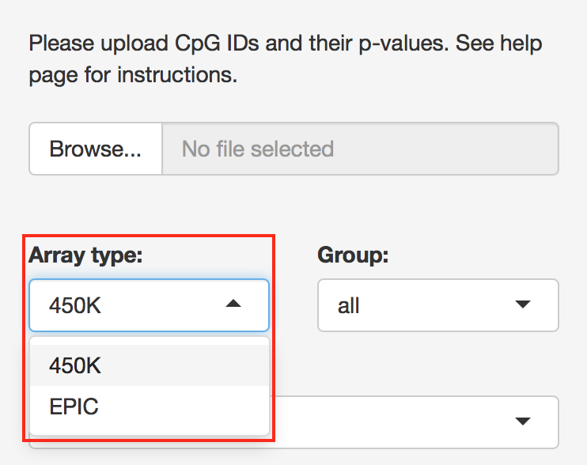{ width=40% }  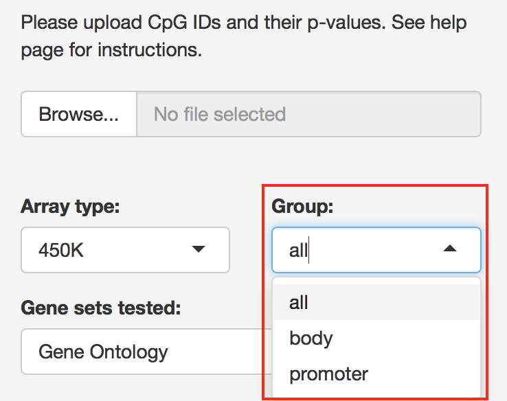{ width=40% }

Array type:  
`450K`: Illumina 450 K Beadchip   
`EPIC`: Illumina EPIC Beadchip

Group:  
`all`: all CpGs are used in gene set testing  
`body`: only the CpGs on gene body are used  
`promoter`: only the CpGs on promoters are used  

 

\noindent
3. Select gene sets to test.

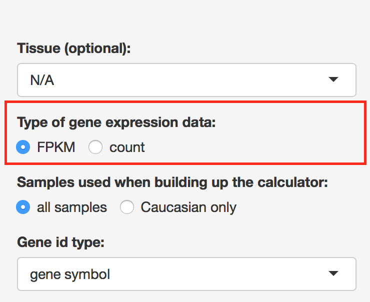{ width=40% }

`Gene Ontology`: http://www.geneontology.org  
`KEGG` (Kyoto Encyclopedia of Genes and Genomes): https://www.genome.jp/kegg/  
`Reactome`: https://reactome.org

 

\noindent
4. Select gene set sizes.

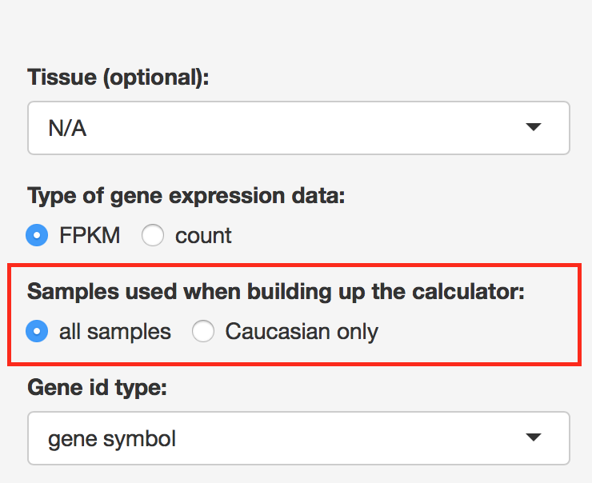{ width=40% }

Gene sets outsize this range will not be tested. 

 

\noindent
5. Select gene set testing method.

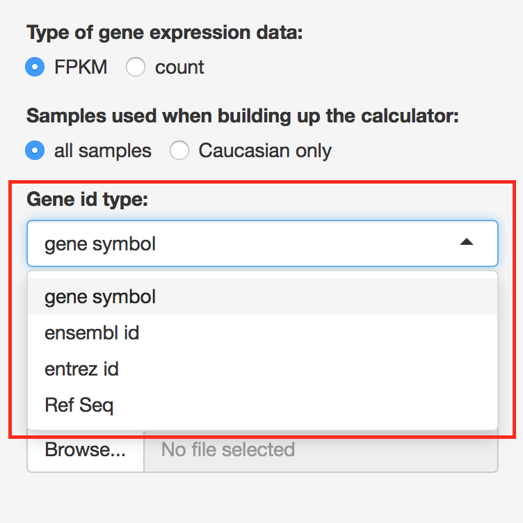{ width=40% }

Check [this page](https://bioconductor.org/packages/devel/bioc/vignettes/methylGSA/inst/doc/methylGSA-vignette.html) for a description of methods. 

 

\noindent
6. Hit "GO!".

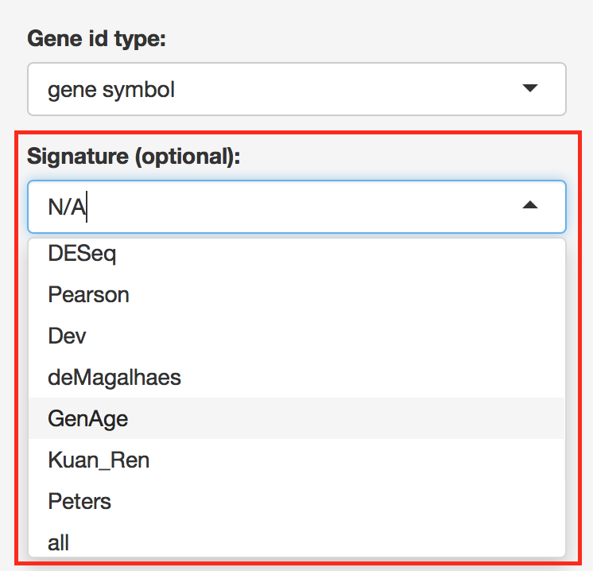{ width=40% }

Gene set testing is running in the background. Depending on the number of gene sets tested, it may take several seconds to several minutes. Once it is done, the result is going to show up on the right hand panel. 

 

### Interpreting the results

The result of gene set testing is presented in two formats, namely table and box plot.

Hit "Download as csv" or "Download as txt" to save the results table to a csv or txt file:

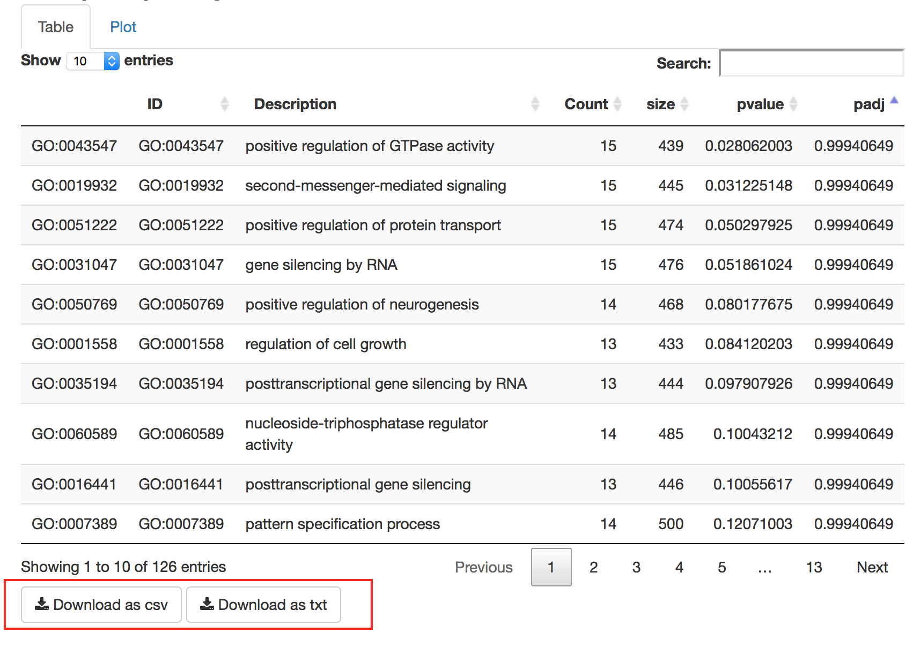{ width=70% }

 

Various options are provided for users to customize the box plot:

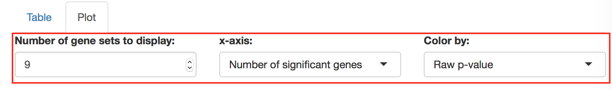{ width=70% }

`Number of gene sets to display`: The number of genes sets to display on the plot.  
`x-axis`: Either the number of significant genes in each gene set or the total number of genes. The number of significant genes is not available for methylglm and methylRRA(GSEA) because they are FCS methods.   
`Color by`: Color the barplot by either raw p-value or adjusted p-value. 

Hit "Download as pdf" or "Download as png" to save the boxplot to a pdf or png file:

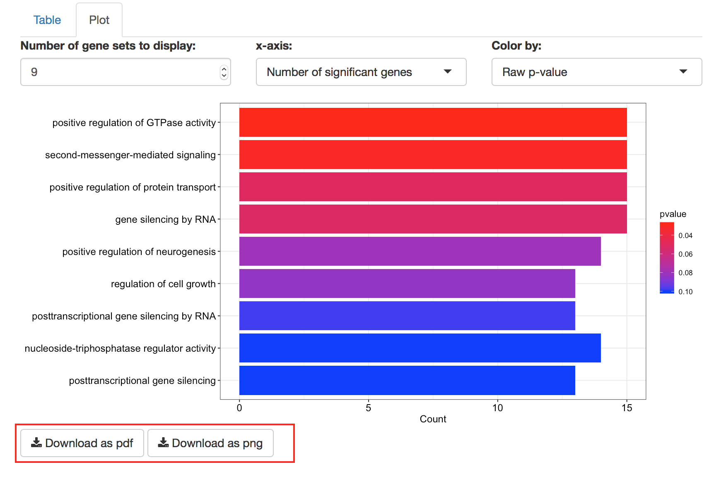{ width=70% }

