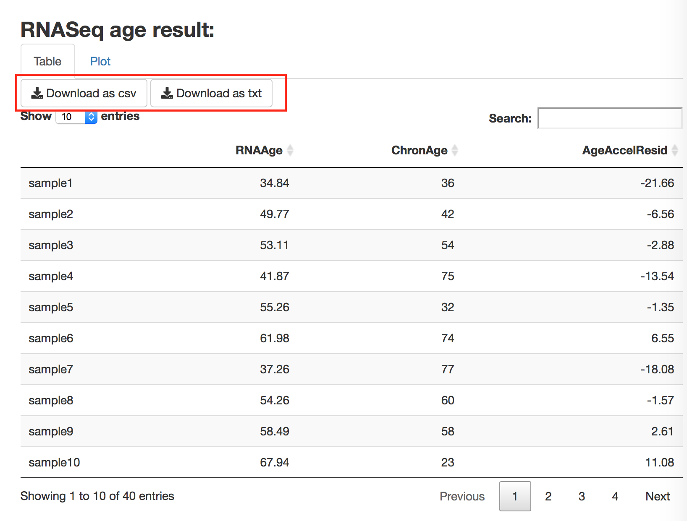

 

This app is a web interface for the Bioconductor package RNAAgeCalc. To use it, follow 
the steps below.

### Step 1
Click on "Browse" to upload gene expression data. 

{ width=40% }

The gene expression data could be either FPKM or raw count. Here are the requirements of the uploaded file:

* The file should be in **csv** format. 
* Each row represents a gene and each column represents a sample.
* The 1st column should be gene ids.
* The 1st row should be sample ids.

{ width=100% }

An example of FPKM file can be found [**here**](https://raw.githubusercontent.com/reese3928/RNAAgeCalc-instruction/master/exfpkm.csv).    
An example of raw count file can be found [**here**](https://raw.githubusercontent.com/reese3928/RNAAgeCalc-instruction/master/excount.csv).

### Step 2 (optional)
Choose which tissue the gene expression data is obtained from. If the tissue cannot be found in the list, set it to N/A. 

{ width=40% }  

### Step 3
Select whether the provided gene expression data is FPKM or gene counts.

{ width=40% }

### Step 4
Select which version of pre-trained calculators to use. Two versions are provided. If "all samples" is selected, the calculator trained on samples from all races (American Indian/Alaska Native, Asian, Black/African American, and Caucasian) will be used. If "Caucasian only" is selected, the calculator trained on Caucasian samples only will be used. We found that RNA Age signatures could be different in different races (see our paper for details). Thus we provide both the universal calculator and race specific calculator. 

{ width=40% }

### Step 5
Choose the gene id type in the uploaded gene expression data.

{ width=40% }

### Step 6 (optional)
Choose which gene signature to use. This step is optional.    

In the case that it is set to N/A (default), if tissue in step 2 is selected, the tissue specific age signature given by our DESeq2 analysis result on GTEx data will be used. Otherwise, the across tissue signature "GTExAge" will be used.    

In the case that it is selected, it should be one of the following signatures.    

* DESeq2. DESeq2 signature was obtained by performing differential expression 
analysis on each tissue and select the top differential expressed genes.
* Pearson. Pearson signature represents the genes highly correlated with 
chronological age by Pearson correlation.    
* Dev. Dev signature contains genes with large variation in expression across 
samples. We adapted the gene selection strategy discussed in 
[1], which is a gene must have at least a $t_1$-fold 
difference in expression between any two samples in the training set and at 
least one sample have expression level > $t_2$ FPKM to be included in the 
prediction models. $t_1$ and $t_2$ (typically 5 or 10) are thresholds to 
control the degree of deviance of the genes. We used $t_1$ = $t_2$ = 10 for 
most tissues. For some tissues with large sample size, in order to maximize 
the prediction accuracy while maintaining low computation cost, we increased 
$t_1$ and $t_2$ such that the number of genes retained in the model is 
between 2,000 and 7,000.    
* deMagalhaes. deMagalhaes signature contains the 73 age-related genes by 
[2].    
* GenAge. GenAge signature contains the 307 age-related genes in the Ageing 
Gene Database [3].    
* GTExAge. GTExAge signature represents the genes consistently 
differentially expressed across tissues discussed in our paper.   
* Peters. Peters signature contains the 1,497 genes differentially expressed 
with age discussed in [4].    
* all. "all" represents all the genes used when constructing the RNAAge 
calculator. 

If the genes in `exprdata` do not cover all the genes in the signature, 
imputation will be made automatically by the `impute.knn` function in 
Bioconductor package 
[impute](https://www.bioconductor.org/packages/release/bioc/html/impute.html).

{ width=40% }

### Step 7 (optional)
Provide gene length. This is optional. 

{ width=40% }

If the type of gene expression data is FPKM, this step will be automatically skipped. If the type of gene expression data is gene counts, it will be converted to FPKM internally. If gene length is not provided, the length will be obtained from the internal database. If gene length is provided, it should be a **csv** file. The 1st column should be gene id and the 2nd column should be the corresponding length in bp.

{ width=100% }

An example of gene length file be found [**here**](https://raw.githubusercontent.com/reese3928/RNAAgeCalc-instruction/master/exlength.csv).    

### Step 8 (optional)
Provide chronological age. This is optional. 

{ width=40% }

If provided, it should be a **csv** file with 1st column sample id and 2nd column chronological age. The sample order in this file doesn’t have to be in the same order as in the uploaded gene expression data. However, the samples in this file and the uploaded gene expression file should be the same. If this file contains more than 2 columns, only the first 2 columns will be used. If more than 30 samples’ chronological age are available, age acceleration residual will be calculated. Age acceleration residual is defined as the residual of linear regression with RNASeq age as dependent variable and chronological age as independent variable.

{ width=100% }

An example of chronological age file be found [**here**](https://raw.githubusercontent.com/reese3928/RNAAgeCalc-instruction/master/exchronage.csv).    

### Step 9 
Hit GO!

{ width=40% }

### Interpreting the results

The result is presented in two formats, namely table and scatter plot.

Hit "Download as csv" or "Download as txt" to save the results table to a csv or txt file. Please note the chronological age and age acceleration residual columns may not show up if the chronological age is not uploaded. 

{ width=70% }

Hit "Download as pdf" or "Download as png" to save the RNAAge vs chronological age plot to a pdf or png file. Please note this plot may not be available if the chronological age is not uploaded. 

{ width=70% }

### References

[1] Fleischer, Jason G., et al. “Predicting age from the transcriptome of human dermal fibroblasts.” Genome biology 19.1 (2018): 221.

[2] de Magalhães, João Pedro, João Curado, and George M. Church. “Meta-analysis of age-related gene expression profiles identifies common signatures of aging.” Bioinformatics 25.7 (2009): 875-881.

[3] de Magalhaes, Joao Pedro, and Olivier Toussaint. “GenAge: a genomic and proteomic network map of human ageing.” FEBS letters 571.1-3 (2004): 243-247.

[4] Peters, Marjolein J., et al. “The transcriptional landscape of age in human peripheral blood.” Nature communications 6.1 (2015): 1-14.
